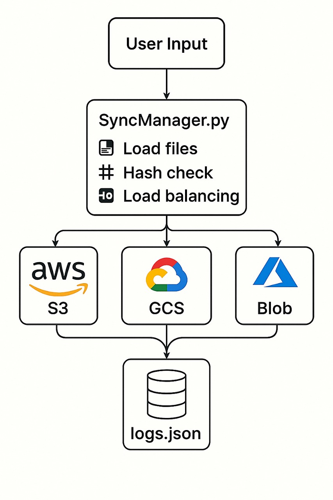

# Multi-Cloud Backup System

A robust, fault-tolerant multi-cloud backup system that intelligently syncs files across AWS S3, Google Cloud Storage, and Azure Blob Storage with redundancy, cost optimization, and data recovery capabilities. This implementation uses distributed backup policies, erasure coding, cross-cloud data verification, and automated recovery to ensure high availability and durability.

## Features

- **Distributed Backup Policy**: Files are stored on a primary cloud with backups on secondary/tertiary clouds based on file type and user-defined policies.
- **Erasure Coding**: Splits files into fragments with parity data, distributing them across clouds to reduce storage costs while maintaining fault tolerance.
- **Cross-Cloud Data Verification**: Validates file integrity using checksums and ensures consistency across providers.
- **Auto-Recovery**: Automatically retrieves files from alternate clouds in case of data loss or provider failure.
- **Cost-Aware Syncing**: Prioritizes cost-effective storage options (e.g., AWS Glacier for archival files).
- **Multi-Region Deployment**: Supports geo-distributed backups across different cloud regions for enhanced reliability.
- **Interactive CLI**: User-friendly interface to list, upload, and download files with tabular displays and multi-file download support.
- **Secure Configuration**: Stores API credentials securely using environment variables.

## Architecture

The system is designed with the following components:

1. **Policy Engine**:
   - Determines primary and backup clouds based on file type, size, or user preferences.
   - Example policy:
     - `.txt`: AWS S3 (primary), Google Cloud Storage (secondary)
     - `.jpg`: Azure Blob (primary), AWS S3 (secondary)
     - `.mp4`: Google Cloud (primary), Azure Blob (secondary), AWS S3 (tertiary)

2. **Erasure Coding Module**:
   - Uses a library like `pyeclib` to split files into `k` data fragments and `m` parity fragments.
   - Stores fragments across clouds, allowing reconstruction from any `k` fragments.
   - Reduces storage overhead compared to full replication.

3. **Storage Abstraction Layer**:
   - Unified interface for AWS S3 (`boto3`), Google Cloud Storage (`google-cloud-storage`), and Azure Blob Storage (`azure-storage-blob`).
   - Handles uploads, downloads, and file listing with provider-specific logic.

4. **Sync Manager**:
   - Manages file uploads with redundancy rules (e.g., store on at least two clouds).
   - Implements parallel uploads using threading.
   - Performs deduplication using SHA-256 hashes.

5. **Verification and Recovery Manager**:
   - Computes and compares checksums across clouds to detect corruption.
   - Reconstructs files from fragments or alternate clouds if a provider fails.
   - Maintains a distributed file index (SQLite) for quick lookup.

6. **Logging and Monitoring**:
   - Logs backup and recovery operations to a file (`backup.log`) and SQLite database.
   - Alerts on failures (configurable for email/SMS).

7. **Configuration Manager**:
   - Loads credentials and settings from a `.env` file.
   - Supports secure storage of API keys and user policies.
  


## Prerequisites

- **Python 3.8+**
- **Cloud Accounts**:
  - AWS: S3 bucket, access key, and secret key.
  - Google Cloud: Storage bucket, project ID, and service account key (`gcp-keys.json`).
  - Azure: Blob Storage container and connection string.
- **Dependencies**:
  - Install required Python packages:
    ```bash
    pip install -r requirements.txt
    ```

## Installation

1. **Clone the Repository**:
   ```bash
   git clone https://github.com/yourusername/multi-cloud-backup-cs.git
   cd multi-cloud-backup-cs
   ```

2. **Set Up Environment**:
   - Create a `.env` file with your cloud credentials:
     ```
     AWS_ACCESS_KEY_ID=your_aws_access_key
     AWS_SECRET_ACCESS_KEY=your_aws_secret_key
     AWS_BUCKET_NAME=your_aws_bucket
     GCP_PROJECT_ID=your_gcp_project_id
     GCP_BUCKET_NAME=your_gcp_bucket
     AZURE_CONNECTION_STRING=your_azure_connection_string
     AZURE_CONTAINER_NAME=your_azure_container
     BACKUP_FILE_LIST=backup_files.txt
     LOG_FILE=logs.json
     ```
   - Place your Google Cloud service account key (`gcp-keys.json`) in the project root.

3. **Install Dependencies**:
   ```bash
   pip install boto3 google-cloud-storage azure-storage-blob python-dotenv colorama tabulate pyeclib
   ```

4. **Prepare Backup File List**:
   - Create a `backup_files.txt` file with absolute paths to files you want to back up:
     ```
     /path/to/file1.txt
     /path/to/photo.jpg
     /path/to/video.mp4
     ```

## Usage

Run the main script to access the interactive CLI:
```bash
python backup_system.py
```

### CLI Menu
```
=== Multi-Cloud Backup System ===
Select an option:
1. List backed-up files
2. Upload files from backup_files.txt
3. Download backed-up files
4. Exit
```

- **Option 1: List Backed-Up Files**:
  - Displays a table of all files stored across clouds:
    ```
    +---------+------------------------+-----------------------+
    | Sr No   | File Name (First 10)   | Source Service        |
    +---------+------------------------+-----------------------+
    | 1       | file1.txt             | AWS S3                |
    | 2       | photo.jpg             | Azure Blob Storage    |
    | 3       | video.mp4             | Google Cloud Storage  |
    +---------+------------------------+-----------------------+
    ```

- **Option 2: Upload Files**:
  - Reads `backup_files.txt` and uploads new or modified files.
  - Applies the distributed backup policy and erasure coding.
  - Skips unchanged files using SHA-256 hashes.
  - Output example:
    ```
    Checking files to upload...
    Uploading /path/to/file1.txt to AWS S3...
    Successfully uploaded /path/to/file1.txt to AWS S3
    Uploading fragments to Google Cloud Storage...
    Successfully uploaded fragments to Google Cloud Storage
    ```

- **Option 3: Download Files**:
  - Lists all backed-up files and prompts for serial numbers (e.g., `1` or `1,2,3`).
  - Reconstructs files from fragments or retrieves from alternate clouds if needed.
  - Example:
    ```
    Enter serial number(s) to download (e.g., 1 or 1,2,3): 1,2
    Downloading file with serial number 1...
    Downloaded file1.txt from AWS S3 to ./file1.txt
    Downloading file with serial number 2...
    Downloaded photo.jpg from Azure Blob Storage to ./photo.jpg
    ```

- **Option 4: Exit**:
  - Gracefully exits the program.

## Configuration

### Backup Policy
Edit `backup_policy.json` to customize storage strategies:
```json
{
  "policies": [
    {
      "file_type": ".txt",
      "primary": "AWS S3",
      "secondary": "Google Cloud Storage",
      "tertiary": null
    },
    {
      "file_type": ".jpg",
      "primary": "Azure Blob Storage",
      "secondary": "AWS S3",
      "tertiary": null
    },
    {
      "file_type": ".mp4",
      "primary": "Google Cloud Storage",
      "secondary": "Azure Blob Storage",
      "tertiary": "AWS S3"
    }
  ]
}
```

### Erasure Coding
- Configured with `k=4` data fragments and `m=2` parity fragments by default.
- Modify in `config.py`:
  ```python
  ERASURE_CODING = {
      "k": 4,  # Data fragments
      "m": 2   # Parity fragments
  }
  ```

## Deployment Options

1. **Single VM Deployment**:
   - Run on a single cloud VM (e.g., AWS EC2) to manage backups.
   - Suitable for small-scale setups but risks single point of failure.

2. **Multi-Region Deployment**:
   - Deploy on VMs in different cloud regions (e.g., AWS US-East, GCP Europe, Azure Asia).
   - Enhances fault tolerance by avoiding regional outages.

3. **Geo-Distributed Backup**:
   - Configure buckets/containers in different regions for maximum durability.
   - Example:
     - AWS S3: `us-east-1`
     - Google Cloud Storage: `europe-west1`
     - Azure Blob Storage: `eastasia`

## Technical Details

- **Erasure Coding**:
  - Uses `pyeclib` to implement Reed-Solomon coding.
  - A file is split into `k=4` data fragments and `m=2` parity fragments, distributed across clouds.
  - Any `k=4` fragments can reconstruct the file, tolerating up to `m=2` cloud failures.

- **Cross-Cloud Verification**:
  - Computes SHA-256 checksums for each file and fragment.
  - Periodically verifies integrity across clouds and triggers auto-recovery if mismatches are detected.

- **Auto-Recovery**:
  - Maintains a SQLite database (`file_index.db`) to track file locations and fragment metadata.
  - If a primary cloud fails, retrieves fragments from secondary/tertiary clouds or reconstructs using erasure coding.

- **Performance**:
  - Parallel uploads/downloads using Python `threading`.
  - Deduplication reduces unnecessary uploads by checking file hashes.

- **Security**:
  - Credentials are stored in a `.env` file, not hardcoded.
  - Supports encrypted storage (cloud provider-specific) for sensitive files.

## Limitations

- **Complexity**: Erasure coding and distributed policies increase setup and maintenance overhead.
- **Cost**: Storing fragments across multiple clouds may incur higher costs than single-cloud solutions, though optimized by policy-based storage.
- **Latency**: Reconstruction from fragments can be slower than direct file retrieval.
- **No Real-Time Monitoring**: File changes must be manually triggered via `backup_files.txt`.

## Future Enhancements

- **Real-Time File Monitoring**: Add a file watcher for automatic sync on changes.
- **Versioning**: Support file versioning to preserve older versions.
- **Advanced Monitoring**: Integrate email/SMS alerts for backup failures.
- **Containerized Deployment**: Package as a Docker container for easier deployment.

## License

This project is licensed under the MIT License. See the [LICENSE](LICENSE) file for details.

